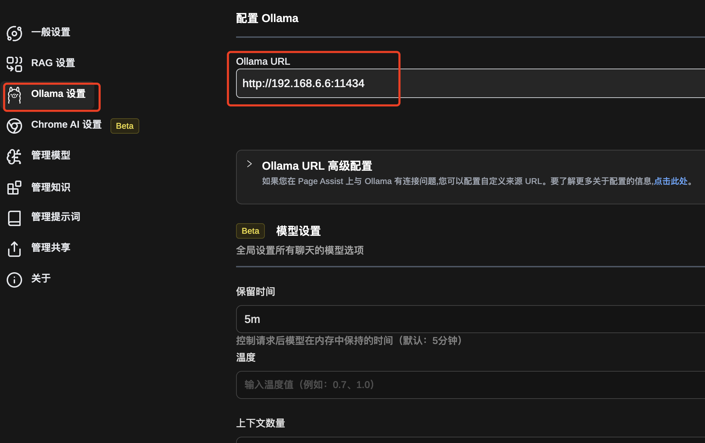
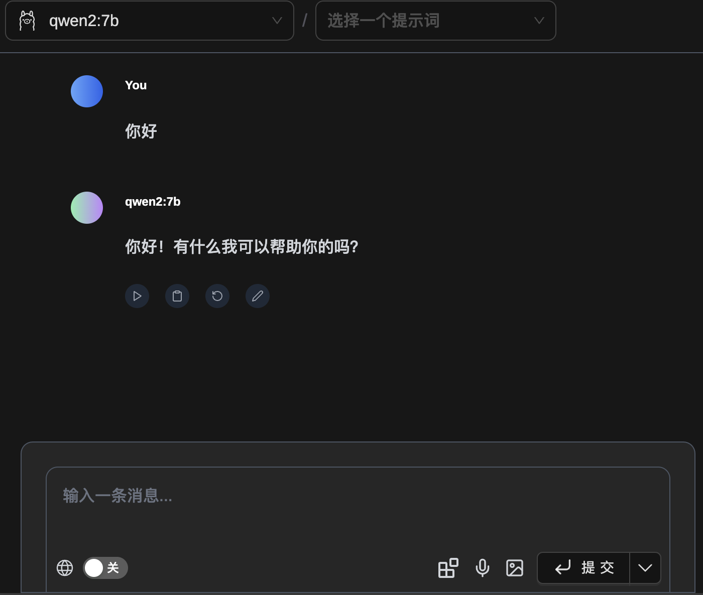
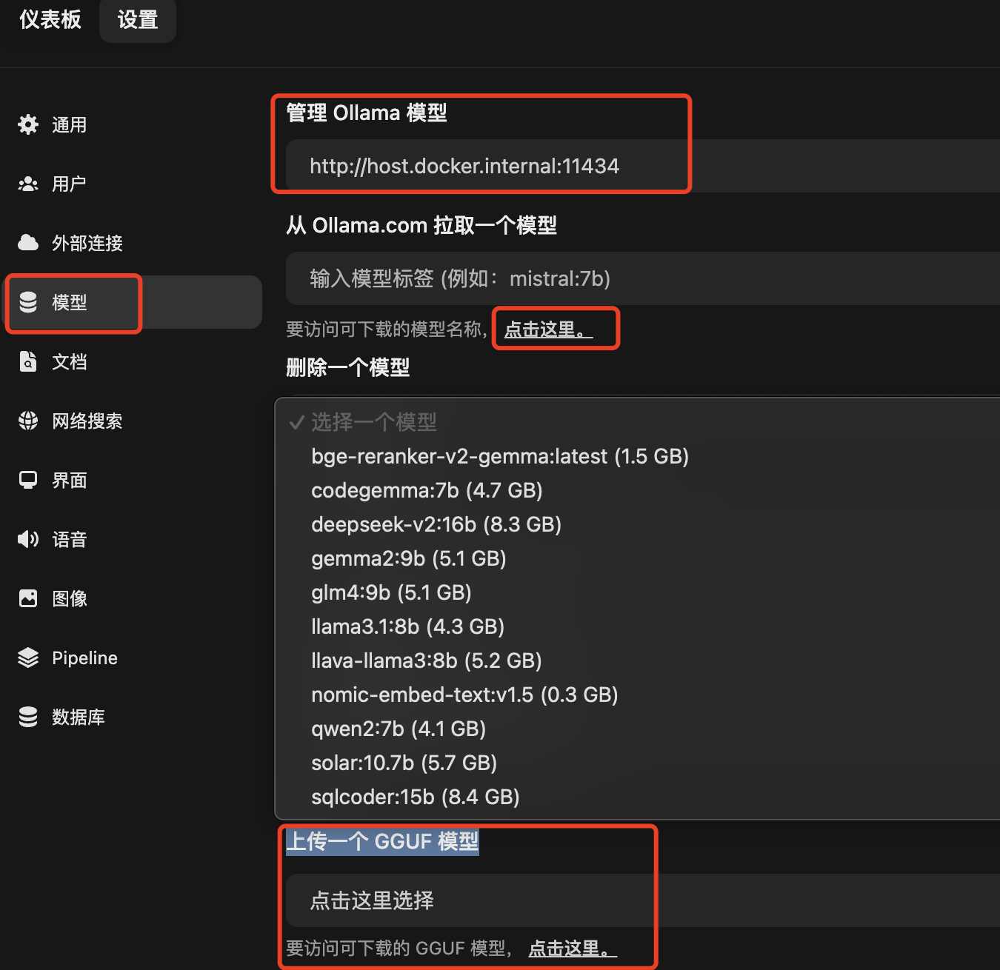
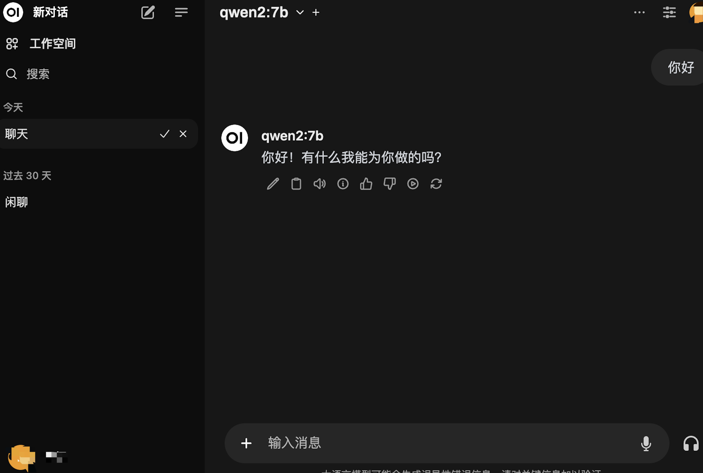

大模型（Large Language Models）作为AI领域的颠覆性创新，凭借其在语言生成、理解及多任务适应上的卓越表现，迅速点燃了科技界的热情。
从阿尔法狗的胜利到GPT系列、包括国内的文心一言等的横空出世，大模型不仅展现了人工智能前所未有的创造力与洞察力，也预示着智能化转型的新纪元。
这些大模型都是往往部署于云端，人们在使用时只需要注册账号，支付费用就可以方便快捷的使用大模型，但是这也存在着一些问题：

- 目前最先进的OpenAI的GPT系列模型，由于某些原因对国内用户并未开放。
- 对于特殊行业企业来，这些大模型并不能满足企业的特殊需求。
- 隐私问题和数据安全：企业与研究机构开始寻求在本地环境部署大模型的方法，同时构建专属的私有知识库，以实现更高程度的控制和灵活性。
- 收费问题：对于个人来说，如果是一个重度用户，那么使用成本将是不能忽视的问题。


本地部署大模型的优势：

- 隐私和数据安全得到保障。
- 特殊行业可以基于开源大模型进行微调。
- 免费。


今天就来介绍一款可以在本地运行开源的 LLM（大型语言模型）服务工具Ollama。Ollama也是目前本地运行大模型最简单的服务工具，尤其适合普通PC。


> Ollama是一个开源的 LLM（大型语言模型）服务工具，用于简化在本地运行大语言模型、降低使用大语言模型的门槛，使得大模型的开发者、研究人员和爱好者能够在本地环境快速实验、管理和部署最新大语言模型，包括如Qwen2、Llama3、Phi3、Gemma2等开源的大型语言模型。

## Ollama 安装和常用系统参数设置


#### 下载安装Ollama服务工具


首先下载并安装Ollama工具
- MacOS [下载](https://ollama.com/download/Ollama-darwin.zip)
- Windows [下载](https://ollama.com/download/OllamaSetup.exe)
- Linux [请参见](https://github.com/ollama/ollama/blob/main/docs/linux.md)。

另外Ollama还只是Docker安装

CPU only
```
docker run -d -v ollama:/root/.ollama -p 11434:11434 --name ollama ollama/ollama
```

如果是 Nvidia GPU，需要先安装 [NVIDIA Container Toolkit](https://docs.nvidia.com/datacenter/cloud-native/container-toolkit/latest/install-guide.html#installation).

启动容器
```
docker run -d --gpus=all -v ollama:/root/.ollama -p 11434:11434 --name ollama ollama/ollama

```

如果是AMD GPU
```
docker run -d --device /dev/kfd --device /dev/dri -v ollama:/root/.ollama -p 11434:11434 --name ollama ollama/ollama:rocm
```

如果仅仅只是想运行模型，不启动服务的话可以：
```
docker exec -it ollama ollama run llama3.1
```


Ollama工具安装比较简单，详细的安装可以参考官方的文档 [Windows](https://github.com/ollama/ollama/blob/main/docs/windows.md)、[Linux](https://github.com/ollama/ollama/blob/main/docs/linux.md)、[Docker](https://github.com/ollama/ollama/blob/main/docs/docker.md)


#### 常用的系统环境变量参数


- OLLAMA_MODELS：模型文件存放目录
    > 默认目录为当前用户目录
    > Windows C:\Users%username%.ollama\models，
    > MacOS ~/.ollama/models，
    > Linux /usr/share/ollama/.ollama/models

- OLLAMA_HOST：Ollama 服务监听的网络地址，
    > 默认为127.0.0.1，如果允许其他电脑访问Ollama（如：局域网中的其他电脑）
    > 建议设置成0.0.0.0，从而允许其他网络访问
- OLLAMA_PORT：Ollama 服务监听的默认端口，默认为11434
- OLLAMA_ORIGINS：HTTP 客户端请求来源，半角逗号分隔列表，若本地使用无严格要求，可以设置成星号，代表不受限制。
- OLLAMA_KEEP_ALIVE：大模型加载到内存中后的存活时间（单位秒）
    > 默认为5m即 5 分钟（300秒）
    > 0 代表处理请求响应后立即卸载模型
    > 任何负数则表示一直存活
    > 如果请求频繁，建议设置时间更长一点，比如24h，即模型在内存中保持 24 小时，提高访问速度
- OLLAMA_NUM_PARALLEL：请求处理并发数量，默认为1，即单并发串行处理请求，可根据实际情况进行调整
- OLLAMA_MAX_QUEUE：请求队列长度，默认值为512，可以根据情况设置，超过队列长度请求被抛弃
- OLLAMA_DEBUG：输出 Debug 日志标识，应用研发阶段可以设置成1，即输出详细日志信息，便于排查问题
- OLLAMA_MAX_LOADED_MODELS：最多同时加载到内存中模型的数量，默认为1，即只能有 1 个模型在内存中


## Ollama 管理和下载大模型

安装好Ollama之后可以通过命令行终端，执行ollama -h 查看下都有哪些命令

```shell
> ollama -h    
Large language model runner

Usage:
  ollama [flags]
  ollama [command]

Available Commands:
  serve       Start ollama
  create      Create a model from a Modelfile
  show        Show information for a model
  run         Run a model
  pull        Pull a model from a registry
  push        Push a model to a registry
  list        List models
  ps          List running models
  cp          Copy a model
  rm          Remove a model
  help        Help about any command
```

可以通过执行下面的命令即运行qwen2:7b大模型，首次运行需要先下载模型7b的模型4.4GB，大概需要几分钟。

```shell
ollama run qwen2:7b
```

**从远程仓库下载其他大模型到本地**，登录[官方模型仓库](https://ollama.com/library)

```shell
>ollama pull qwen2:0.5b
pulling manifest
pulling manifest
pulling manifest
pulling manifest
pulling manifest
pulling 8de95da68dc4... 100% ▕████████████████████████▏ 352 MB
pulling 62fbfd9ed093... 100% ▕████████████████████████▏  182 B
pulling c156170b718e... 100% ▕████████████████████████▏  11 KB
pulling f02dd72bb242... 100% ▕████████████████████████▏   59 B
pulling 2184ab82477b... 100% ▕████████████████████████▏  488 B
verifying sha256 digest
writing manifest
removing any unused layers
success
```

一般7b的模型大概需要8G的内存或者显存，如果硬件条件允许尽可能下载更多参数的模型，以获得更好的推理效果。
如果硬件条件一般，可以下载小一点的，qwen2最小的0.5b，只有5亿参数，有1G的内存可能就能满足。
官方的模型仓库有很多大语言模型、多模态模型、嵌入模型等，可以根据自身需要下载合适的模型。

**查看已下载的模型列表**

```shell
>ollama list
NAME            ID              SIZE    MODIFIED
qwen2:0.5b      6f48b936a09f    352 MB  9 minutes ago
qwen2:7b        e0d4e1163c58    4.4 GB  10 days ago
```


## 运行大模型

执行下面的命令，即可开启大模型对话
```shell
ollama run qwen2:7b

>>> hello
Hello! How can I assist you today?
```


这种方式显然不够友好，这里给大家推荐两款web客户端

#### 介绍两款WebUI

**Page Assist**

> 这个是一款chrome浏览器插件，[下载安装](https://chromewebstore.google.com/detail/page-assist-%E6%9C%AC%E5%9C%B0-ai-%E6%A8%A1%E5%9E%8B%E7%9A%84-web/jfgfiigpkhlkbnfnbobbkinehhfdhndo?hl=zh-CN)，[开源项目地址](https://github.com/n4ze3m/page-assist),
> 安装简单，使用方便,同时也支持本地知识库。


设置



对话




**open webui**
> 是一种可扩展、功能丰富且用户友好的自托管 WebUI，更多介绍可以查看[官网](https://docs.openwebui.com/)
> 安装稍显复杂，需要python和node环境,如果不是研发人员，不对源码做修改，建议直接使用Docker部署安装
    
```shell
docker run -d -p 3000:8080 --add-host=host.docker.internal:host-gateway -v open-webui:/app/backend/data --name open-webui --restart always ghcr.io/open-webui/open-webui:main
```

打开浏览器访问 http://localhost:3000

设置



对话



同时还只是导入GGUF模型，这样就省的编写Modelfile


## Ollama Modelfile

在使用 Ollama 进行本地部署和运行大型语言模型时，Modelfile 扮演着至关重要的角色。它是一个文本文件，用于定义和配置模型的行为和特性。

关于Ollama Modelfile的详细用法参考[官方文档](https://github.com/ollama/ollama/blob/main/docs/modelfile.md)，这介绍一下GGUF 导入模型的方式。

> Ollama 模型仓库提供了很多开源大模型，还支持高度的模型自定义和扩展能力。这意味着开发者可以根据特定的需求调整模型参数，或者导入已有的模型，以此来创建更加个性化的AI应用。以下是几种自定义模型的方法。


- 首先，下载模型的GGUF格式的文件
- 然后，创建一个名为Modelfile的文件，该文件包含指向你想要导入模型的本地文件路径的FROM指令。例如：

```shell
FROM ./your-model-path.gguf
```

- 执行命令，在 Ollama 中创建模型

```shell
ollama create example -f Modelfile
```

- 运行自定义模型，检查是否创建成功

```shell
ollama run example
```


## 结语
本文粗略的介绍了Ollama搭建本地大模型的基本的安装和使用方法，想要完整了解Ollama，建议参考[官方文档](https://github.com/ollama/ollama/blob/main/README.md)，后面的文章中我们将继续介绍Ollama的其他用法，比如：Modelfile，比如从 PyTorch 或 Safetensors 导入模型，自动量化等。