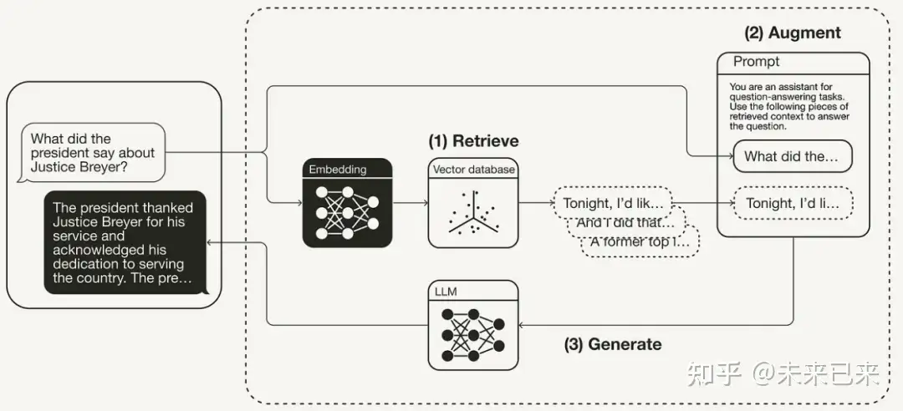

> 说到人工智能就不得不提大模型，大模型是人工智能领域中的一个概念，是指那些具有巨大参数量（通常上万亿个参数以上）的深度学习模型。这些模型在大规模数据集上进行预训练，旨在捕捉广泛的知识和模式，并且可以应用于各种下游任务中，如自然语言处理、图像识别、语音识别等。

## 什么是大模型

大模型之所以重要，在于它们的规模和训练方式。这些大规模预训练模型通过在海量数据上进行无监督学习，能够学习到复杂的语言、图像和其他形式的数据表示。然后，通过简单的微调过程（只需要对少量任务相关数据进行调整），这些模型就能应用于特定的任务，比如生成文本、翻译、问答系统等。

大模型的普及和应用正在改变AI的发展路径，推动了从“专用”模型向“通用”模型的转变，并且提高了人工智能系统的性能和效率。然而，大模型也带来了诸如计算资源需求高、训练时间长以及潜在的伦理问题等挑战。

## 闭源大模型开源大模型

闭源大模型通常指的是那些由特定组织、机构或个人开发并拥有知识产权的大模型。
例如：GPT-4o、文心一言等

这些闭源模型的优势在于：

*   专有优化：开发者能够根据特定需求对模型进行定制和优化，通常能实现更高的性能。
*   知识产权保护：拥有者可以控制模型的使用、修改和分发，保护其商业价值和技术优势。
*   封闭生态：在某些情况下，闭源模型可能构建了较为封闭的技术生态系统，提供集成服务或API给开发者和企业。

开源大模型指的是公开共享其源代码的大模型。这类模型通常遵循开放源代码许可协议（如Apache 2.0、MIT等），允许任何人免费使用、修改和分发。代表性的例子包括：

*   Hugging Face的Transformers库：这不仅是一个预训练语言模型的集合，还提供了用于微调这些模型的强大工具和API。

开源模型的优势在于：

*   社区贡献与创新：大量的开发者可以贡献代码、改进算法或创建新的应用，加速技术的演进。
*   透明度与验证：公开源代码增加了模型使用的透明性，有助于学术研究和验证成果。
*   多样化的应用生态：开源模型促进了广泛的行业应用，允许不同背景和规模的用户根据需要进行定制。

## 大模型的局限性

“没有应用，光有一个基础模型，不管是开源还是闭源，一文不值”这是百度创始人、董事长兼CEO李彦宏出席2024年世界人工智能大会（WAIC 2024）发表主题演讲时提出的观点。之所以提出这样的观点，原因在于大模型的局限性：

*   **经济和技术障碍**：大模型开发成本高且技术门槛较高，这限制了小型机构或独立开发者获取这些资源的可能性。这也可能导致市场上的同质化竞争和垄断现象。

*   **计算资源需求高**：训练大型模型需要大量的计算资源，包括高性能GPU、大规模的数据集以及长时间的训练周期。这不仅增加了成本，而且对于小型研究团队或初创公司来说是一个重大挑战。

*   **能量消耗与环境影响**：训练大型神经网络模型需要大量的电力，这不仅对环境产生显著影响（如温室气体排放），也使得可持续性成为重要议题。

    > 大模型的训练和推理依赖强大的算力，英伟达表示，训练一个拥有1.8万亿参数的人工智能模型需要大约2000个Blackwell GPU。

    > Anthropic的首席执行官达里奥·阿莫代伊（Dario Amodei）指出，当前市场上人工智能模型的培训成本已高达约1亿美元。他进一步表示：“目前正在训练的模型，以及预计在今年晚些时候或明年年初不同时间推出的模型，其成本已接近10亿美元。而在我看来，到了2025年和2026年，这一成本将飙升至50亿或100亿美元。”

    > 基于以上的技术门槛、计算资源、能量消耗，高成本这对于个人和小企业根本无力承担，只有科技大厂有这个实力，当然这也是闭源模型一大优势。

*   **数据依赖性**：大模型通常需要大量高质量的标注数据进行训练，这在某些特定领域如医疗健康、社会伦理问题等可能受到隐私和数据可获取性的限制。

    > 目前的大模型的训练数据是基于公开的数据，比如维基百科、各类发表的专业杂志、社交媒体、新闻等。对于企业内部知识数据和未发表的机密数据无法做出正确且权威的推理。

    > 虽然大模型在特定任务上表现优异，但在处理未见过的数据时可能容易出现过拟合现象。也就是幻觉（也就是胡说八道）。

*   **解释性和透明度**：由于这些模型非常复杂且包含数以百万计甚至数十亿个参数，它们通常被认为是“黑盒”，难以理解其决策过程。这对一些需要明确、可解释的结果的领域（如法律或医疗）来说是一个问题。

*   **隐私与安全风险**：由于这些模型大量依赖于用户数据进行训练和优化，因此存在严重的隐私泄露风险。特别是在处理敏感信息如个人识别、医疗记录或金融交易时，这种风险更为突出。

*   **伦理和道德考量**：大模型在生成有害内容、偏见放大以及潜在的社会影响等方面引发了广泛讨论和关注。确保模型的公正性、公平性和无偏见是一个持续挑战。

基于以上大模型存在的各种问题，对于大模型的应用落地造成了一定障碍。在解决上述问题过程中，业界也在尝试通过各种各样的方法解决，例如：提示词工程、RAG、知识谱图、Agent、智能体等。

#### 提示词工程

> 提示词工程涉及使用特定的文本（即“提示词”）作为输入，来指导模型生成所需的输出。这个过程可以视为对预训练模型进行微调的一种方式，不需要大量的额外训练数据和计算资源。

> 它利用了大语言模型在理解人类指令的能力，通过简单的字符串或短语向模型提供详细的指导信息。

当AI出现幻觉（胡说八道）时，其中有一种情况就是：大模型不能正确理解你的意思，因此无法给出预期的结果，因此提示词工程就是来指导模型生成所需的输出。

提示词工程简单来说就是告诉大模型你希望他干什么、怎么干。

实现方法，可以充下面几个方面：

1.  **精确指令**：

    提供明确、具体的指令是关键。例如，“将这篇新闻报道转换为一篇更客观的角度”或“用简洁的语言重写这段代码”。

2.  **上下文信息**：

    在输入时加入额外的上下文信息，可以帮助模型更好地理解任务背景和语境。

3.  **结构化提示**：

    使用模板或结构化格式提供指导。比如，在生成对话时使用问句作为提示词可以引导模型更自然地继续对话流程。

4.  **迭代调整与反馈**：

    根据初始结果调整提示词，通过多次尝试和优化来改进输出质量。

想要详细了解提示词工程可以参考**[提示词工程指南](https://www.promptingguide.ai/zh)**

#### 知识库（RAG）

> RAG 是检索增强生成（Retrieval Augmented Generation ）的简称，它为大语言模型 (LLMs) 提供了从数据源检索信息的能力，并以此为基础生成回答。简而言之，RAG 结合了信息检索技术和大语言模型的提示功能，即模型根据搜索算法找到的信息作为上下文来查询回答问题。无论是查询还是检索的上下文，都会被整合到发给大语言模型的提示中。

检索增强生成（Retrieval-Augmented Generation，简称 RAG）就像给学生在写论文前提供一本庞大的图书馆参考书。

**为什么需要RAG？**

想象一下一个语言模型试图写一篇关于“人工智能”的文章。它从训练数据中学到了很多，但可能缺乏关于最新突破、最新的伦理争论或人工智能历史的具体信息。

RAG通过让模型在生成文本之前从知识库中检索相关信息来解决这个问题。可以将其比作模型“咨询专家”或“进行研究”，以丰富其理解并产生更准确、更有见地的输出。

**举例说明：**

以客服系统为例：

```
客户咨询：“我的订单什么时候能发货？”

AI回答：无法帮你查询订单的发货时间
```
那么在采用RAG系统增强生成技术后
```
客户咨询：“我的订单******什么时候能发货？”

AI回答：查询到您的订单******，在*年*月*日已经发出，预计*年*月*日送达，请注意查收。
```

显然在采用RAG系统增强生成技术后，智能客服系统已经具备了更强的生产力，那么背后的技术原理又是什么呢？

- 第一个阶段检索： 根据用户请求从外部知识源检索相关上下文。为此，使用嵌入模型将用户查询嵌入到与向量数据库中的附加上下文相同的向量空间中。这允许执行相似性搜索，并返回矢量数据库中最接近的前 k 个数据对象。
- 第二个阶段增强：用户查询和检索到的附加上下文被填充到提示模板中。
- 第三个阶段生成：最后，检索增强提示被馈送到 LLM。




到这里我们对检索增强生成（RAG）原理有了大致的了解，RAG就是弥补大模型知识不足的问题，在这其中起决定性作用的就是检索，检索结果的准确和完整性直接决定了最终结果的质量，那么业界普遍采用向量数据库来构建知识库。在后面的学习笔记中会着重介绍。


#### AI Agent

想象一下，当你问AI“明天天气怎么样？”，AI会说不知道、或者胡说八道，也就是幻觉，为何会出现这样的情况呢？这是因为大模型的知识不足，大模型对现实世界当前的状态，也就说当前世界发生的事情、包括当前的时间、你的地理位置，都一无所知，因此就无法做出正确合理的回答。


> AI 助手 (AI Agent) 主要解决的是如何使人工智能能够自主地执行任务和与用户进行交互的问题。简单来说，它让 AI 不仅仅是提供信息，而是可以像一个真实的代理人一样行动。

想象一下一个名叫 "小艾" 的 AI 助手，它可以帮你完成以下任务：

- 你可以通过语音或文字向小艾发出指令，例如 "明天天气怎么样？”。
- 小艾会根据你的指令从网络上获取信息你的地理位置、根据位置从网络上获取信息，总结给出结果。
小艾就是一个典型的 AI 助手，它通过自主地执行任务和与用户进行交互，有效地帮助人们解决日常问题，提高工作效率和生活品质。

AI Agent就是希望AI能够像人类一样，接到一个任务，进行任务分析、拆解、规划、查询信息、执行、总结。

不仅仅只是查询信息，AI Agent能够帮我们实现更为复杂的任务、比如回复邮件、预约会议、让AI真正成为生产力工具。


## 结语

我们惊叹于AI的推理能力的同时，AI大模型依然存在各种各样的问题，例如幻觉、信息时效性，对复杂任务无法像人类一样拆解、规划、执行等。业界同样给出了一些解决方案，这需要我们持续学习，提示词工程、RAG、Agent、大模型微调等。这也导致很难设计出通用的应用解决所有问题，因此需要根据不同场景特殊性具体分析设计。保持好奇心、乐观积极、让AI真正成为我们手中生产力工具。